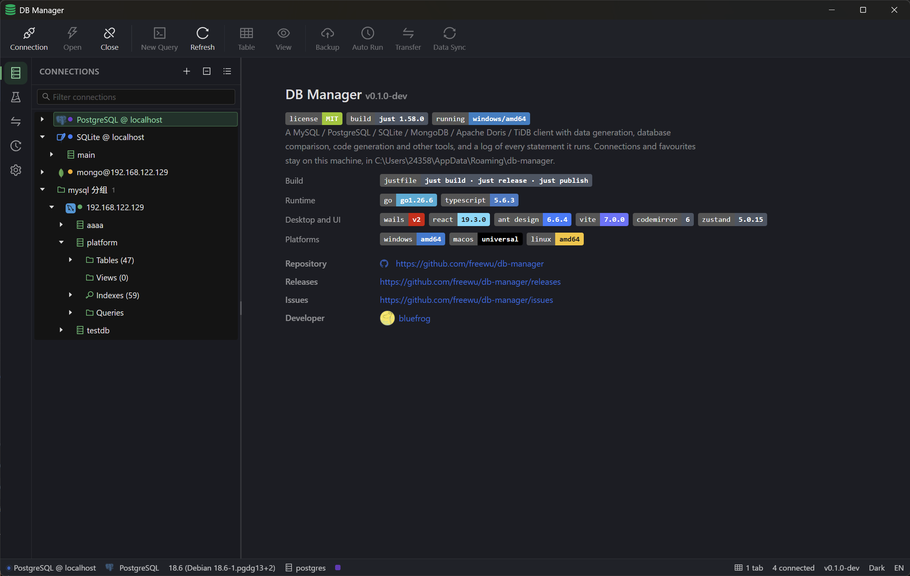
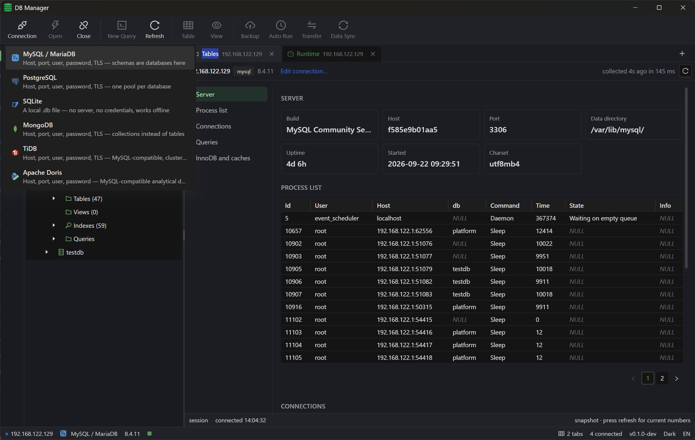
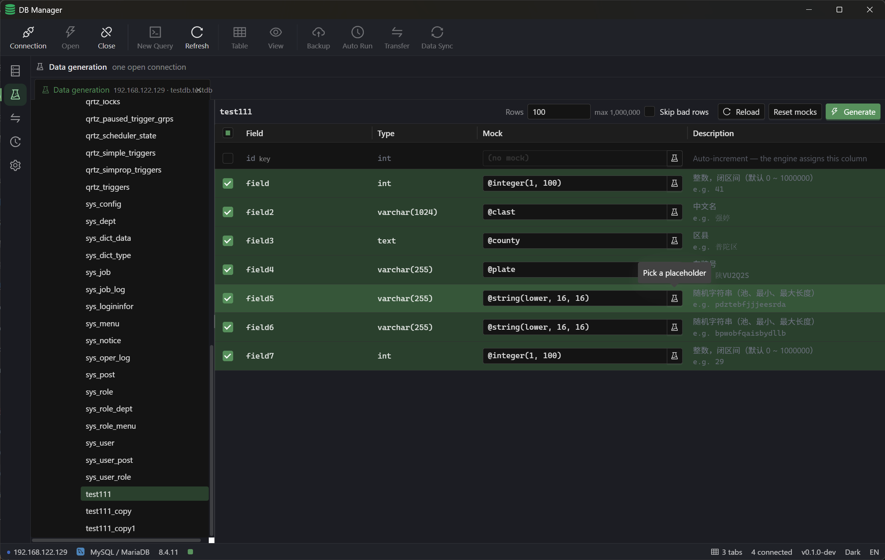
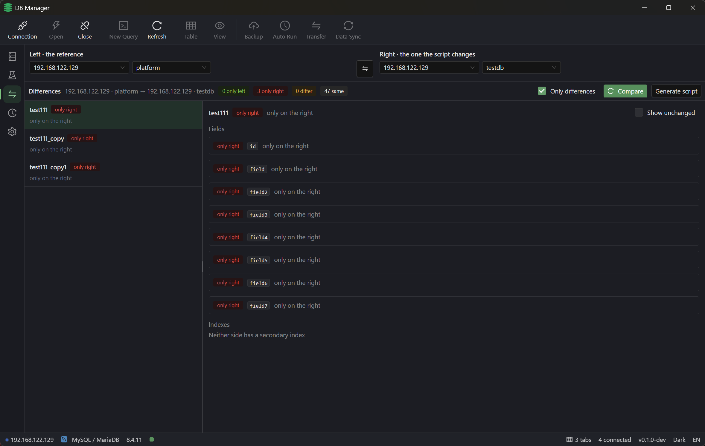
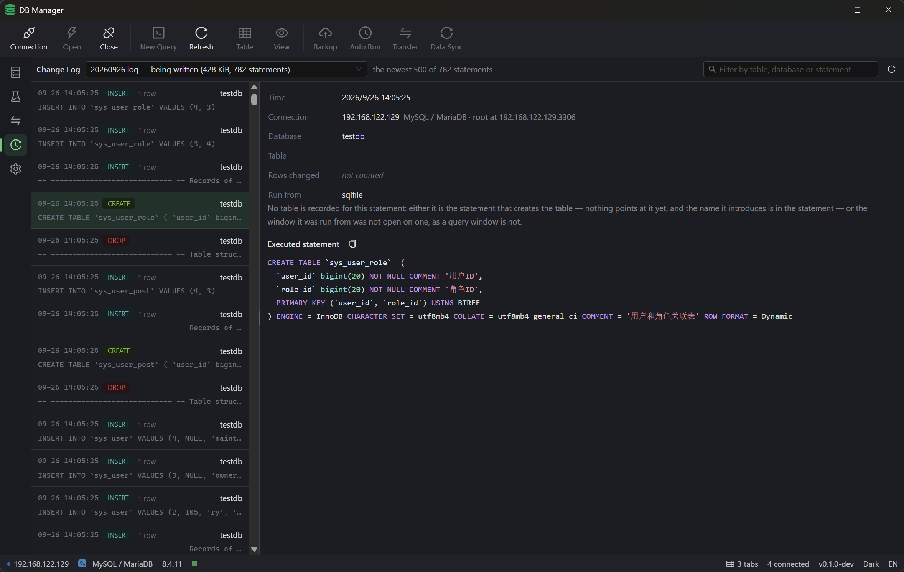
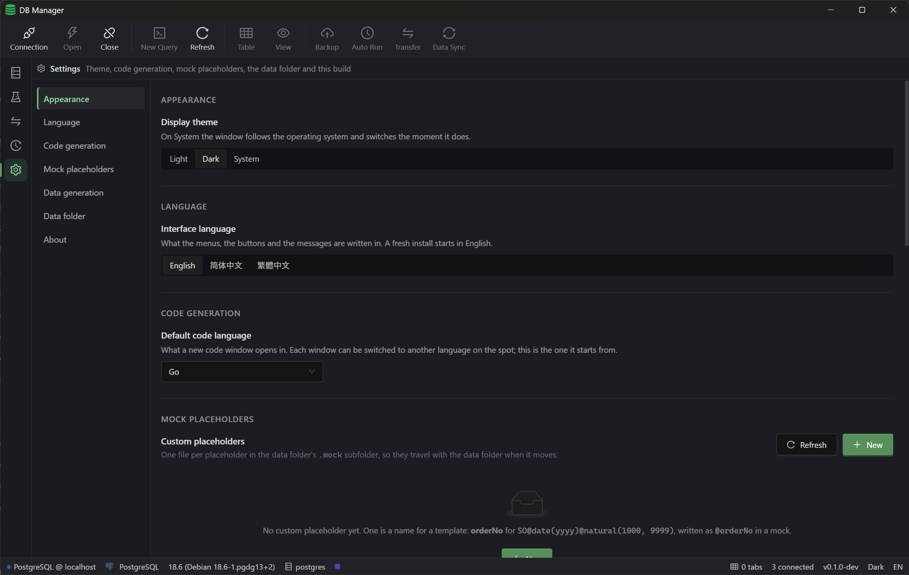

# db-manager

**English** · [简体中文](README_CN.md) · [繁體中文](README_TC.md)

A desktop database client for six engines — **MySQL, PostgreSQL, SQLite, MongoDB, TiDB and Apache Doris** — built with Wails v2 + React, shipped as one self-contained executable for Windows, macOS and Linux.

It is not only a browser. It exports whole databases, runs a `.sql` file statement by statement, fills tables from mock.js templates, diffs two databases and writes the sync script, designs tables, generates code in 18 languages, and keeps a change log of every write statement it was asked to run — including how many rows each one touched. Anything that changes data asks first, showing the statement the engine will actually receive.

The driver layer does not assume a relational model: document engines go through the same `Driver / Conn / Dialect` contract, and the UI asks about capabilities rather than engine names — so an entry point an engine cannot serve (the table designer for MongoDB or Doris, data generation, Explain) is absent instead of failing after the click. Oracle and SQL Server are parked in `internal/drivers/planned`.

> Working in this repository? Read [`AGENTS.md`](AGENTS.md) first — every task ends with a commit and a push.

## Screenshots

Six windows, from the workspace to settings — the same images the [introduction page](docs/index.html) shows. Every one is a real window, not a mock-up.

| Workspace | Connections |
| --- | --- |
|  |  |
| **Data generation** | **Database comparison** |
|  |  |
| **Change log** | **Settings** |
|  |  |

## Download

Every release ships three **portable executables**. Nothing to install: the frontend bundle is embedded, so the single file *is* the application. Take the one for your platform from the [latest release](https://github.com/freewu/db-manager/releases/latest) — `<version>` below is the release you are downloading, for example `0.1.0`:

| Platform | File | How to run |
| --- | --- | --- |
| Windows x64 | `db-manager-<version>-windows-amd64.exe` | Double-click. Needs the WebView2 runtime (Windows 10/11 already ship it) |
| macOS (Intel + Apple Silicon) | `db-manager-<version>-macos-universal.zip` | Unzip it, drag `db-manager.app` into Applications |
| Linux x64 | `db-manager-<version>-linux-amd64` | `chmod +x db-manager-<version>-linux-amd64 && ./db-manager-<version>-linux-amd64` |

The macOS build is not signed or notarised, so Gatekeeper blocks the first launch: right-click → Open, or `xattr -cr /Applications/db-manager.app`. The Linux build links against GTK3 and WebKitGTK 4.0 (`libgtk-3-0 libwebkit2gtk-4.0-37` on Debian/Ubuntu). A `checksums.txt` sits next to the downloads: `sha256sum -c checksums.txt`.

## Features

- **Connections** — create, edit, test, colour-tag and mark read-only; TLS (CA / certificate / key) and custom DSN parameters; one form per driver, so a file connection never shows host and port. Saving a password is optional and it is stored encrypted.
- **Object explorer** — a lazy session → database → schema → table / view / index tree, where every folder is drawn even when it is empty (`Tables (0)`), and which folders exist is decided by the engine. Right-click to open data, design a table, copy a name, duplicate / truncate / drop a table, run a SQL file, export a database or generate code.
- **Data grid** — paging, server-side sorting and filtering (14 operators), resizable columns, multi-select, hover previews for long text, and a row-detail panel that slides in when you click a row (fields, primary key, NULLs, copy as JSON or INSERT, and inline edits).
- **Row editing** — inline cell editing and batch delete; every statement is built from the primary key and uses bound parameters, and the rendered statement is shown before it runs.
- **Table designer** — edit field names, types, nullability, defaults, primary key, auto-increment and comments; drag rows by their handle to reorder (row order is column order). Save shows exactly which statements will be executed, one by one. Creating a table is the same path with an empty baseline.
- **SQL editor** — CodeMirror 6, per-driver dialect, multi-statement execution, history, completion of the tables and views in the window's own namespace, `Ctrl/Cmd+Enter` to run, `Ctrl/Cmd+Shift+F` to format.
- **Query plan** — Explain asks the engine how it *would* run the statement; the wrapper never adds `ANALYZE`, so nothing executes and a read-only connection can explain a `DELETE` before you decide.
- **Structure and DDL** — columns, indexes, foreign keys and the engine's own DDL, syntax-highlighted and copyable. Document engines get a sampled field list instead, because a collection has no schema.
- **ER diagram** — a namespace as a graph: related tables share a row, foreign key levels are ordered left to right, and you can drag, zoom, search, hide fields and export the diagram as SVG.
- **Database compare** — two databases of the same engine side by side, table by table: only left / only right / differs / same, with the differing fields and indexes listed. *Generate script* writes the diff itself (create, then alter, then drop); the only decision left is whether to drop the tables that exist on the right only.
- **Data generation** — one mock.js template per column, with a picker of 40+ placeholders plus your own, suggested from the column name and type. Rows go in batches of 200 with progress, Stop, and a closing sentence that says how many rows landed and how long it took.
- **Database export** — structure / structure and data / data only from the database node: a whole `.sql` script (the engine's own `CREATE` plus `INSERT`s), or a single table as CSV, JSON, JSONL or SQL with selectable columns. Read and written entirely in the backend, streaming straight to disk, with progress and Stop.
- **Run a SQL file** — hand the backend a `.sql` file on disk. It runs the file statement by statement, so every write is logged with its own row count. You first see what is inside (destructive statements in red, what a read-only connection will refuse, `USE` and unrecognised statements as warnings), then progress, Stop, and a summary that names the statement that failed. No transaction wraps the file, and the UI says so.
- **Code generation** — a table's fields as a class or struct in 18 languages (Java with and without Lombok), nullability handled per language, names per convention, syntax-highlighted, copy or save.
- **Change log** — every write statement this program was asked to run, with time, connection, database / schema, table, source window and the engine's affected rows. One file per day under `<data dir>/log/`, rotated whole instead of trimmed, and readable without a connection.
- **Create database** — the server answers what it needs (charsets and collations, encoding and locale) and the statement is shown before it runs.
- **Overview** — double-click a connection for its live server-side facts: process list and InnoDB hit rate, backends and commit rate, or the pragma view of a SQLite file. A metric the engine cannot read shows `—` with a warning, never a `0`.
- **Settings** — one page for theme (light / dark / system), interface language, code-generation language, mock placeholders, the data folder (open it, move it, set how many log entries a file holds) and project information. Every change applies immediately.
- **Interface languages** — English, 简体中文 and 繁體中文, English by default. The status bar and the Windows tray menu switch the same preference.
- **Tray (Windows)** — closing the window hides it. The menu brings the window back, switches the display theme and the interface language, links to the project, and quits.

## Supported engines

| Engine | Default port | Notes |
| --- | --- | --- |
| MySQL | 3306 | TLS, charset and collation aware creation, full table designer |
| PostgreSQL | 5432 | Schema layer, `serial` / identity awareness, encoding and locale |
| SQLite | file | ATTACH aliases, pragma overview, no `TRUNCATE` (uses `DELETE`) |
| MongoDB | 27017 | Replica sets, `mongodb+srv`, TLS, a mongosh-style shell, no schema |
| TiDB | 4000 | MySQL wire protocol, TLS, cluster member table |
| Apache Doris | 9030 | MySQL wire protocol, read-only browsing, changes through the DDL editor |

MySQL, TiDB and Doris share one wire-protocol package, so they share the connection, browsing, grid, query and export code as well. Adding an engine means implementing `Driver` / `Conn` / `Dialect` and registering it in `init()`.

## Requirements

| Tool | Version |
| --- | --- |
| Go | 1.24+ (1.26.5 in development) |
| Node.js | 20+ (24.10.0 in development) |
| Wails CLI | v2.16.0 |
| just | 1.58.0 (optional, for the convenience recipes) |
| WebView2 | Bundled with Windows 10/11; older systems need the runtime |

## Build from source

```sh
just install     # npm install + go mod download
just dev         # development mode: Vite HMR + Go live reload
just build       # production build, output in build/bin/db-manager.exe
just release     # build + archive into release/ with checksums (never touches git)
just publish 0.2.0 "what changed"   # sync the version, commit, tag, push
just --list      # every recipe
```

Without `just`:

```sh
cd frontend && npm install && npm run build && cd ..
wails build
```

`wails build` produces a desktop binary, so on Windows run it with the **Windows toolchain** (a Windows terminal or `just.exe`), not from WSL.

## Where the data lives

Connection profiles, saved queries, connection order, window state, the password key and the change log live in one data folder: `%APPDATA%\db-manager` on Windows, `~/Library/Application Support/db-manager` on macOS, `~/.config/db-manager` on Linux. Its location is recorded in `location.json`, and Settings → *Data folder* moves the whole set by copying, verifying byte by byte, rewriting the pointer and only then deleting the old files.

Passwords are encrypted with AES-256-GCM under a key generated on first use (`secret.key`, mode 0600). Nothing is sent anywhere: there is no telemetry, and the app talks only to the databases you configured.

## How it is put together

Wails v2 hosts a React 19 + Vite frontend in a WebView2 / WebKit window; `app.go` is the binding layer the frontend calls. The frontend is written by hand against `frontend/src/api/{types,client}.ts` rather than the generated bindings, and keeps its state in one zustand store. UI copy lives in `frontend/src/lib/i18n/messages/<area>.ts` as `[English, 简体, 繁體]` and is checked by `scripts/i18n.mjs verify`; backend Go strings are still English.

```
app.go, main.go          Wails bindings, window, embedded frontend/dist
tray*.go                 Windows tray menu (theme + language) and the no-op stubs
internal/drivers/        Driver / Conn / Dialect contracts, sqlbase, one package per engine
internal/service/        manager, design, export, compare, changelog, data generation
internal/config/         JSON stores, the data folder pointer, change log files
frontend/src/            React UI: components, lib, i18n, store, styles
docs/                    the introduction page (static, no build step)
scripts/                 version.mjs, package.mjs, i18n.mjs, docs-check.mjs,
                         readme-check.mjs, pages-build.sh, release-notes.sh
```

Four invariants are worth knowing before changing something:

- **A table design is a complete target definition, not a diff.** The backend plans it against the live catalog, so preview and save run the same code; an engine limitation becomes a `Plan.Warnings` entry rather than a silent skip.
- **Every write asks first, then says what it changed.** The statement in the confirmation dialog is the statement that is sent, and the change log records the rows the engine reported.
- **Nothing runs inside a transaction it cannot honour.** DDL is not rollback-safe and the SQL-file runner says so instead of pretending.
- **Brand artwork has exactly one source**, `asserts/`; `frontend/public/logo.png` and `build/appicon.png` are copies made by `just icons`.

## Tests

```sh
just test                        # go test ./...
npm --prefix frontend run build  # tsc --noEmit + vite build
node scripts/i18n.mjs verify     # translations match their English source
node scripts/docs-check.mjs      # the introduction page, its copy and its screenshots
node scripts/readme-check.mjs    # the three READMEs: same shape, links, screenshots, downloads
bash scripts/pages-build.sh _site          # assemble the copy the Pages workflow publishes
node scripts/docs-check.mjs --site _site # …and check that every reference stays inside it
```

The Go suite needs no cgo and no service containers — SQLite is pure Go. The MongoDB, TiDB and Doris integration tests skip themselves unless you point them at a server:

```sh
DMB_TEST_MONGODB_HOST=127.0.0.1 go test ./internal/drivers/mongodb/ -run Integration -v
DMB_TEST_TIDB_HOST=127.0.0.1 go test ./internal/drivers/tidb/ -run Integration -v
DMB_TEST_DORIS_HOST=127.0.0.1 go test ./internal/drivers/doris/ -run Integration -v
```

## Releasing

Pushing a `v*` tag runs [`.github/workflows/release.yml`](.github/workflows/release.yml): it verifies that the version mirrors agree, that the tag matches `wails.json` and that the brand assets have not drifted, then builds on Windows, macOS and Linux runners and publishes the three executables plus `checksums.txt`.

The release message is rendered by [`scripts/release-notes.sh`](scripts/release-notes.sh) from the annotated tag message and the commits since the previous tag, grouped by Conventional Commit type — which is why every commit subject has to be a sentence a user can read.

```sh
just notes v0.2.0   # preview the release message for a tag
```

`just release` stays local: it builds the host platform and archives it under `release/` without touching git.

## Introduction page

[`docs/index.html`](docs/index.html) is a static introduction page: one HTML file, one stylesheet, one script, and an `i18n.js` holding the copy in the same three languages. There is no build step, so it opens straight from disk, and the six screenshots in `docs/images/` drive both the carousel and the gallery. `scripts/docs-check.mjs` keeps the three dictionaries, the screenshot references and the relative paths honest, and CI runs it.

It is also published as the project site, <https://freewu.github.io/db-manager/>, by [`.github/workflows/pages.yml`](.github/workflows/pages.yml). A project site lives under a sub-path, where the page's `../asserts/…` and `../wails.json` references would climb past the site root, so `scripts/pages-build.sh` assembles a published copy with the brand artwork and the version manifest beside the page — and `node scripts/docs-check.mjs --site _site` checks that copy before it goes up. CI builds it as well, so a reference that escapes the site is caught on the pull request rather than on the live page.

One-time setup: **Settings → Pages → Build and deployment → Source: GitHub Actions**.

## Roadmap

- [x] MySQL / PostgreSQL / SQLite: browse, edit, query, structure, export
- [x] Table designer, saved queries, DDL editor, query plan and formatter, ER diagram, create database, overview, change log, data generation, code generation
- [x] MongoDB, then TiDB and Apache Doris
- [x] Database compare with a sync script; confirmation before every write; per-statement logging
- [x] Database export; run a SQL file
- [x] Three interface languages; display theme and language switching from the Windows tray
- [ ] Oracle / SQL Server (the dialect stubs are already there)
- [ ] SSH tunnels, table data import (CSV / Excel), plugins

## License

[MIT](LICENSE)
